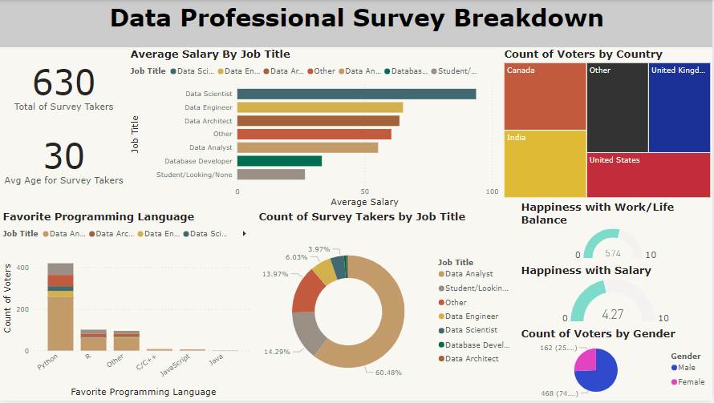

# DataProSurvey_ETL_Visualization
This Power BI project provides a comprehensive breakdown of the Data Professional Survey, accomplished through two fundamental steps:

## 1. ETL (Extract, Transform, Load)
Leveraging Power Query, the data undergoes a meticulous transformation process to ensure consistency and integrity. Key steps include:
- **Removing Empty Columns:** Eliminates unnecessary columns to streamline the dataset.
- **Standardizing Columns:** Ensures uniformity in data formatting for accurate analysis.

## 2. Visualization on Dashboard
After the ETL process, the transformed data is visualized on an interactive Power BI dashboard. This dashboard offers insightful representations of the survey data, allowing for effortless exploration and analysis through intuitive visualizations.

